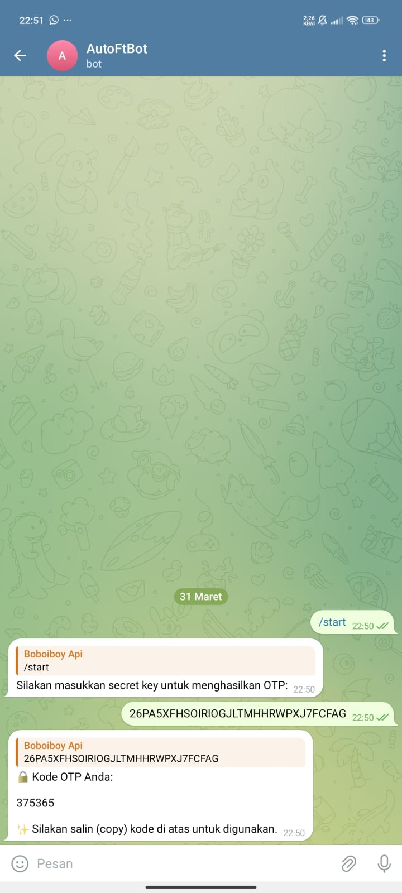

# OTP Generator Telegram Bot

Selamat datang di OTP Generator Telegram Bot! Bot ini memungkinkan Anda untuk menghasilkan One-Time Password (OTP) menggunakan kunci rahasia yang diberikan. Anda dapat menggunakan OTP ini untuk berbagai keperluan keamanan seperti otentikasi dua faktor (2FA) atau verifikasi identitas.

## Fitur

- Menghasilkan OTP berdasarkan kunci rahasia yang diberikan.
- Kunci rahasia minimal 16 digit.
- Tersedia pesan khusus untuk menangani kunci rahasia yang tidak valid.
- Tampilan OTP yang menarik dan mudah disalin (paste).

## Cara Menggunakan

1. Mulai bot dengan perintah `/start`.
2. Masukkan kunci rahasia Anda untuk menghasilkan OTP.
3. Salin (copy) OTP yang dihasilkan dan gunakan untuk keperluan keamanan Anda.

## Cara Menjalankan

1. Instal dependensi yang diperlukan:

  `pip install pyotp`

  `pip install python-telegram-bot`

2. Jalankan bot dengan menjalankan skrip `python3 2fa.py`.

3. Bot siap digunakan!

## Kontribusi

Jika Anda menemukan masalah atau memiliki saran untuk perbaikan, jangan ragu untuk membuka _issue_ atau mengajukan _pull request_. Kami sangat menyambut kontribusi dari komunitas!

## Lisensi

Proyek ini dilisensikan di bawah Lisensi MIT. Lihat [LICENSE](LICENSE) untuk informasi lebih lanjut.
